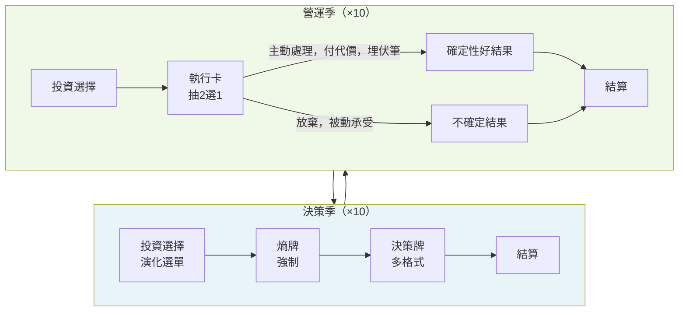

# 《熵與奮鬥者》豐富化方案分析
**問題：遊戲太單一，玩起來很無聊**
日期：2026-04-03

---

## Phase 0 — 現況診斷

讀完 GDD v4.0 和 v4.1 模擬報告後，「太單一」的根因很清楚：

**20 季的結構實際上只有一種節奏：**
- 決策季（×10）：投資 → 熵牌 → 選 A 或 B → 算數字 → 看歸因
- 營運季（×10）：投資 → 算數字 → 看歸因

這裡有三個具體問題：

1. **營運季是空洞的** — 10 季裡玩家除了可能選投資項目，幾乎沒有能動性。商機事件是系統自動觸發的，伏筆也是系統的，玩家坐在那裡看數字跑。這佔了整局的 50%。

2. **決策季格式千篇一律** — 每張決策牌都是一樣的六層模板，都是 A/B 二選一。18 張牌打完，玩家在第 7 局就學會「這個遊戲的感覺」了，沒有驚喜。

3. **投資選單從不演化** — 同樣的 5 個選項貫穿 5 年。Y1 的老闆和 Y5 的老闆面對完全相同的投資工具箱。這讓遊戲失去了成長感。

---

## Phase 1 — 問題確認

**核心問題：** 遊戲缺乏節奏變化和玩家能動性的多樣性。

**硬約束：**
- 單局 50 分鐘不能超
- 無對人 PvP，單人 vs AI
- 遊戲中零教學（覆盤才是出口）
- 現有系統（三條命脈 + 飛輪 + 伏筆）是核心，不動

**「完成」的樣子：**
玩一局後，玩家說「我還想再玩一次，想試試不同策略」，而不是「這個遊戲我大概了解了」。

**爆炸半徑：**
改錯了會破壞教學設計（在遊戲中洩漏知識）、或把遊戲時長從 50 分鐘拉到 70 分鐘。

---

## Phase 2 — 三條根本不同的路

### 方案 A：主動計畫軌道（Active Project Tracks）

**架構概述：**
玩家在遊戲中可以主動發起「戰略計畫」（例如：開拓新客群、建立技術護城河、文化重塑工程）。每個計畫有 3-4 個里程碑，跨越 3-5 季。每季玩家決定要投入多少資源推進計畫。計畫完成給予大型獎勵；中途放棄有懲罰；多個計畫同時跑可以有協同效應。

資料流：玩家選擇發起 → 計畫軌道並行運作 → 每季里程碑事件 → 與卡牌效果疊加 → 完成/中止

**本質差異：** 這是「長線玩家自建目標」，不是「對系統生成事件做出反應」。

**甜蜜點：** 讓玩家覺得自己在「經營公司」而不是「打牌」。

**致命弱點：**
- 設計複雜度高：每個計畫需要 3-4 個里程碑事件，10 個計畫就是 40 個事件要寫
- 時間管理困難：計畫里程碑可能撞上熵牌或決策牌，結算順序複雜
- 「最優解」問題：有些計畫明顯比其他強，會收斂到固定玩法

**反悔成本：中** — 計畫系統可以模組化開發，不動現有代碼；但一旦上線，牌組設計必須配合計畫系統重新考量。

---

### 方案 B：差異化季度節奏（Differentiated Season Cadence）

**架構概述：**
賦予兩種季度各自獨特的決策結構：

**決策季**（戰略層）— 現有結構保留，但擴充決策牌格式多樣性：
- A/B 二選一（現有）
- 三路選擇（其中 C 選項需要命脈達到門檻才解鎖）
- 級聯決策（選 A 後，下一季出現 A1/A2 子選擇）
- 代價光譜（選項 A=高現金低風險、B=低現金高風險、C=零現金但讓情況惡化）

**營運季**（戰術層）— 從被動計算變成主動執行：
- 每個營運季抽 2 張「執行卡」
- 選 1 張主動處理（付小代價，換確定性好結果；且可埋伏筆種子）
- 另 1 張自動結算（效果隨機：可能輕度正、可能輕度負，玩家沒選它就承受不確定性）

**投資選單演化：**
- Y1-2：現有 5 個基礎選項
- Y3 解鎖：市場擴張類（競爭相關）
- Y5 解鎖：傳承類（拉高覆盤評分）

資料流：決策季戰略選擇 → 設定下季命脈基礎 → 營運季戰術選擇 → 主動處理/被動承受 → 影響下次決策季的牌面狀態

**本質差異：** 雙速決策節奏（戰略 vs 戰術）取代現有單一節奏（戰略 vs 空白）。

**甜蜜點：** 解決了核心問題（50% 空洞季度），又不破壞遊戲節奏——營運季仍然比決策季快。

**致命弱點：**
- 執行卡需要專門設計（約 30 張確保不重複），設計工量不小
- 「永遠選最好那張」問題：若執行卡設計不夠咬人，就變成形式上的選擇

**反悔成本：低** — 執行卡是獨立新系統，不影響現有決策牌、熵牌、伏筆系統。最壞狀況是移除它回到原來。

---

### 方案 C：企業成長章節弧（Growth Phase Arc）

**架構概述：**
把 5 年拆成 3 個章節，每章有不同的主導機制和勝利側重：

| 章節 | 年份 | 機制特色 | 勝利側重 |
|------|------|---------|---------|
| 生存期 | Y1-Y2 | 現有基礎系統 | 活下去 |
| 成長期 | Y3-Y4 | 解鎖競爭決策牌 + 組織架構選擇 | 建立壁壘 |
| 傳承期 | Y5 | 解鎖傳承類決策 + 終局博弈 | 留下什麼 |

章節切換時有「轉型事件」：玩家在章節尾端做一個重大的方向選擇（不是牌的 A/B，是「你要走哪條路」），影響下一章開放的卡牌集。

資料流：章節決定可用規則集 → 章節末觸發轉型事件 → 新機制解鎖/舊機制退場

**本質差異：** 改變的是遊戲的時間形狀，不是單一季度的體驗。

**甜蜜點：** 創造「這局第 3 年感覺跟第 1 年完全不一樣」的成長感。

**致命弱點：**
- 設計量最大：等於要設計 3 套機制
- 章節切換是高風險時刻（玩家還在學生存期規則，突然換成成長期規則）
- Y1-Y2 設計若有問題，Y3+ 都建在壞基礎上

**反悔成本：高** — 章節架構和整個牌組年份配置深度綁定，改一個要動很多。

---

## Phase 3 — 取捨矩陣與選擇

| 維度 | A 計畫軌道 | B 季度節奏 | C 章節弧 |
|------|-----------|-----------|---------|
| 簡單性（中階開發者可維護）| 4 — 軌道系統複雜 | 8 — 在現有框架上加一層 | 4 — 三套規則 |
| 正確性（已知邊緣案例）| 6 — 軌道交互難預測 | 8 — 隔離性好 | 6 — 章節切換是地雷 |
| 重玩性 | 9 — 計畫組合多 | 7 — 執行卡隨機 | 7 — 章節路線分叉 |
| 開發體驗 | 5 — 里程碑事件量大 | 8 — 增量、可測試 | 5 — 先設計再驗證 |
| 時間管控 | 6 — 可能爆時 | 9 — 營運季仍然短 | 5 — 轉型事件耗時 |
| Prototype 速度 | 5 | 8 | 4 |
| 解決「無聊」程度 | 7 | 9 | 8 |
| 反悔成本 | 中 | 低 | 高 |

**選 B（差異化季度節奏）。**

理由：它唯一直接解決了核心問題——50% 的遊戲時間（營運季）玩家幾乎沒有能動性。同時它的反悔成本最低，可以在不動現有系統的前提下增量交付。A 方案的設計量在沒有全職遊戲設計師的狀況下是陷阱；C 方案要求三套機制同時好才能好，風險太大。

---

## Phase 4 — 五輪壓力測試

### Round 1 — 對抗性邊緣案例

**邊緣案例 1：執行卡和伏筆衝突**
場景：Y3Q2 是營運季，伏筆在這季爆發（根系 -20），玩家又要抽執行卡。執行卡有一張是「老客戶主動加單 +$30 萬根系+3」。玩家選了這張，但伏筆也在同一季爆發。

問題：結算順序？如果伏筆先爆（根系 -20），玩家「主動處理」的執行卡效果是在爆炸之後疊加？還是可以用執行卡「抵消」伏筆？

**修正：** 執行卡的結算位置必須明確——插在八步結算的 Step 2（決策牌/熵牌效果之後、伏筆之前的 Step 3a 之前）。執行卡不能抵消伏筆，執行卡的效果在伏筆判定之前完成。規則書明確標注。

**邊緣案例 2：「永遠選那張明顯比較好的」**
設計師很容易讓 2 張執行卡一張明顯好、一張明顯差。玩家就會每次自動選那張「好的」，執行卡變成假選擇。

**修正：** 執行卡設計規則：**每組 2 張必須是兩種不同取捨，不是好壞對比**。例如：
- 卡 1：心跳 +5（花 $30 萬）→ 主動員工，短期成本
- 卡 2：根系 +4（無成本但伏筆：客戶期望上升，下季若未滿足 -8）→ 客戶那邊的隱患

這樣保守型玩家選 1，激進型選 2，決策有意義。

**邊緣案例 3：執行卡時間超支**
目前營運季設計是 ~1.25 分鐘。加了執行卡（抽卡 + 閱讀 2 張卡文字 + 決策 + 結算），實測很容易到 2.5 分鐘。10 個營運季 = 多 12.5 分鐘，整局從 50 分鐘變 62.5 分鐘。

**修正：** 執行卡必須超短——卡片文字限制在 30 字以內。A 選項 / B 選項各一行。視覺設計讓閱讀時間壓縮。實測目標：加了執行卡後，單個營運季維持在 ≤ 1.75 分鐘。

---

### Round 2 — 失敗模式分析

**失敗模式 1：執行卡牌池不夠大**
10 個營運季，每季抽 2 張執行卡 = 共 20 張次抽取。若執行卡池只有 15 張，第二輪開始就會重複。對一個 50 分鐘遊戲，重複出現的執行卡會讓玩家有「我見過這個」的疏離感，比沒有執行卡更破壞沈浸。

**修正：** 執行卡最少 25 張，確保一局 20 次抽取有足夠隨機性。按年份標記（Y1-2、Y3-4、Y5）避免在 Y1 抽到「競爭對手收購你客戶」這種不合時宜的牌。

**失敗模式 2：決策牌格式多樣化破壞了玩家的心理預期**
目前玩家每次翻到決策牌，知道結構是 A/B。加入「級聯決策」後，某些決策牌選了 A，下一季會出現一張 A1/A2。這打破了「決策季→營運季→決策季」的節奏——中間插入了一個「隱形決策季」。

**修正：** 級聯決策不作為「突然插入的額外季度」，而是作為**下一個決策季的固定首位牌**。玩家知道「我在 Y2Q1 做的選擇，會讓 Y2Q3 的決策牌是 A1 或 A2 版本」，這保持了節奏，同時增加了跨季的策略感。

**失敗模式 3：投資選單演化打破 Y1 玩家的期待**
Y3 解鎖新投資類別後，玩家需要重新學習選單。如果 Y3 突然多了 3 個新選項而沒有預告，會有認知負荷衝擊。

**修正：** Y2Q4 年度結算時，顯示「下一年新工具解鎖」預告，讓玩家有一個準備期。這不是教學，是「下季預警」系統的自然延伸。

---

### Round 3 — 規模壓力測試

**10x 重玩次數的考驗（50 局）：**
執行卡 25 張，每局遇到 20 張。10 局後玩家開始記住執行卡內容。20 局後玩家可以預判每張的效果。50 局後執行卡變得可預測，退化成「自動最優化選擇」。

**評估：** 對一個單人學習型遊戲，50 局的玩家是高度核心用戶。正常玩家可能玩 5-10 局就達到「學習到位」，不需要設計 50 局的新鮮感。25 張執行卡足夠支撐正常用戶的重玩壽命。核心玩家的重玩壽命靠的是傳承系統和挑戰模式，不是執行卡。**可接受。**

**10x 決策複雜度的考驗：**
若決策牌全部升級為「三路選擇 + 部分需門檻解鎖 + 部分級聯」，一個決策季的認知負荷會上升 30-40%。目前設計是 10 個決策季，18 張牌，每季抽 2 選 1——意味著玩家每季面對 2 張牌的內容。若每張牌有 3 個選項，閱讀量從「比較 2 選項」變成「比較 3 選項 + 確認門檻」。

**評估：** 單純增加選項數量（A/B → A/B/C）的邊際認知成本不高；真正的風險是玩家感到壓力而不是有趣。建議：18 張牌裡，**A/B 標準型維持 10 張，三路選擇加入 6 張，級聯型加入 2 張**。混合格式創造節奏變化，不讓任何一種格式過時。

---

### Round 4 — 整合與遷移現實檢查

**Python 模擬器（sim_full_v3.py）的影響：**
現有模擬器把玩家決策外化成「風格」（保守/平衡/激進/聰明激進）。加了執行卡系統後，模擬器需要為每個風格設定「執行卡選擇傾向」——保守型偏選確定性好結果，激進型偏選有伏筆但可能更高效益的選項。

遷移路徑：
1. 先把執行卡系統設計完整（25 張卡、每張兩個選項）
2. 在模擬器加入執行卡層，風格映射到選卡邏輯
3. 跑 8 局驗證執行卡不破壞現有平衡（存活率 6/8 的分布應保持）
4. 確認後整合進主遊戲

**與現有系統的整合點：**
- 執行卡在八步結算的哪一步？→ Step 2.5（決策/熵牌效果之後、伏筆之前）
- 執行卡能否觸發伏筆種子？→ **是的**，這是系統最重要的升級之一（玩家在營運季的主動選擇可以埋下伏筆，創造歸因感）
- 執行卡與命脈門檻鎖定的關係？→ 執行卡選項同樣受門檻約束（低血量時無法選高成本執行選項）

---

### Round 5 — 假設審查

**假設 1：「玩家在營運季沒事做」是無聊的主因** 
這是合理但不完整的假設。**另一個主因可能是：玩家對系統的不確定性消失得太快。** Y1Q2 第一次看到飛輪觸發很驚喜，Y2Q4 第三次看到就不驚喜了。系統的透明度設計（半透明盒）意味著玩家很快摸清楚因果邏輯。

如果這個假設是真的，光活化營運季還不夠——需要增加「未知性的層次」（系統行為比玩家想象的更複雜）。

**評估：** 執行卡系統的「被動結算卡」（你沒選的那張）設計成「結果不確定」，部分解決了這個問題。但更根本的解法是確保飛輪和死亡螺旋的觸發條件對玩家來說永遠有一點「我沒料到這個」的成分。**不影響 B 方案的核心有效性，但是設計執行卡時要刻意保留一些結果的不可預測性。**

**假設 2：「不讓玩家在營運季累積決策疲勞」**
原設計的被動營運季是有意為之的設計決策——讓玩家有喘息空間。加了執行卡後，每季都有決策，可能違背了這個原始意圖。

**評估：** 這個假設部分正確，但結論不是「不要加執行卡」。解法是確保執行卡的決策「輕」——閱讀 + 選擇 < 10 秒，不像決策牌那樣需要深思。視覺設計上也要讓執行卡看起來比決策牌「輕」。目標感受：決策季是「停下來想想」，營運季是「邊動邊看」。

**假設 3：「18 張決策牌的現有設計都是 A/B 就夠了」**
這個假設已在第 2-3 輪被挑戰。結論：**不夠**。18 張裡應有至少 8 張採用不同格式，否則決策季的「格式預期」會讓玩家提前進入自動駕駛模式。

**假設 4：「投資選單 5 個選項是設計合理的，只是單調」**
事實上，靜態投資選單的問題不只是「選來選去差不多」，而是它讓玩家覺得「Y5 和 Y1 沒有成長」。真實老闆的第 5 年工具箱和第 1 年不一樣。投資選單演化不是複雜度，是真實感。

---

## Phase 5 — 最終交付

### 1. 信心分數：76/100

**影響因素：**
- 方案 B 的核心邏輯很堅實（直接解決 50% 被動問題），但效果完全取決於執行卡的設計質量。
- 25 張執行卡每一張都要達到「真實取捨」的標準，設計者很容易滑回「好 vs 壞」的對比，那就廢了。
- 決策牌格式多樣化需要重新審視現有 18 張牌，部分牌可能需要改寫。

**怎麼提高信心：**
- 先設計 5 張執行卡做 paper prototype，測試「選擇時間」和「取捨感」，確認格式。
- 回頭看 18 張決策牌，標記哪些天然適合升級成三路或級聯格式。
- 這兩件事做完，信心可以到 87+。

---

### 2. 方案（壓力測試後版本）

**核心改變：三個互相支撐的系統升級**

**實作順序（為什麼是這個順序）：**

1. **先設計執行卡（2-3 週）**
   先做才能先測試。執行卡是最高風險的新元素——設計爛了整個方案就爛了。用 5 張原型先跑 Paper Prototype，驗證「快速閱讀 + 快速決策 + 有真實取捨」三個條件都成立。

2. **在 Python 模擬器加執行卡層（1 週）**
   確認執行卡加入後，保守/平衡/激進/聰明激進的存活率和得分分布不被破壞。執行卡不應該讓保守型從「略有勝算」變成「輕鬆過關」。

3. **戰略計畫軌道 Paper Prototype（1-2 週）**
   手動跑 3 局，驗證 5 個計畫的現金流安全性和伏筆種子觸發率。詳見 `project_tracks_spec.md` 驗證目標。

4. **在模擬器加入計畫軌道層（1 週）**
   確認計畫加入後，存活率維持 6/8 分布，且平衡/聰明激進至少完成 1 個計畫。

5. **升級決策牌格式（2 週）**
   18 張牌裡選出 6 張升級為三路選擇、2 張升級為級聯型。標準：只動那些目前「感覺是教科書習題」的牌，不動那些已經有緊張感的牌。

6. **投資選單演化（1 週）**
   Y3 解鎖 2 個競爭類投資選項，Y5 解鎖 1 個傳承類。在年度結算（Q4）提前一季預告解鎖。

**關鍵決策及理由：**

| 決策 | 選擇 | 理由 |
|------|------|------|
| 執行卡插在結算的哪一步？ | Step 2.5（伏筆之前） | 讓主動選擇有機會影響當季命脈，保持歸因清晰 |
| 執行卡能埋伏筆嗎？ | 能 | 這是系統最重要的升級——讓玩家的營運決策有長期後果，而不只是本季效果 |
| 每次抽幾張執行卡？ | 2 張選 1 | 3 張已測試過容易超時，1 張無選擇感 |
| 決策牌格式比例？ | 10 標準 : 6 三路 : 2 級聯 | 不能全換——熟悉的格式給玩家安全感，變化格式帶來驚喜 |
| 投資選單演化從哪年開始？ | Y3 | Y1-2 用基礎選單讓新玩家有立足點，Y3 的解鎖是「你撐到了，工具進化了」的獎勵感 |

**反悔成本：**
- 執行卡系統：**低** — 一個獨立的新牌堆，不影響現有決策牌/熵牌/伏筆
- 決策牌格式升級：**中** — 需改寫特定牌的文本，有回滾成本但不影響系統
- 投資選單演化：**低** — 加選項比刪選項容易，不破壞現有邏輯

**已知限制（有意接受的取捨）：**
- 執行卡不解決「決策牌的取捨感不夠深」問題——那是卡牌文案的問題，不是系統問題
- 不引入 NPC 關係系統（雖然它會增加敘事豐富度），因為它和「零教學原則」有潛在衝突，且設計複雜度超出本次範圍

**前 3 大殘餘風險：**

| 風險 | 緩解方式 |
|------|---------|
| 執行卡設計質量不夠（假取捨） | Paper Prototype 先測試，設計評審 Checklist：每張牌的兩選項至少有一個被不同玩家偏好 |
| 整局時間拉長超過 50 分鐘 | 把執行卡時間壓縮目標寫進設計 spec（閱讀+決策 ≤ 10 秒），先做時間計測再上線 |
| 格式多樣化打亂玩家心理預期 | 保留 10 張標準 A/B 牌作為「熟悉感錨點」，新格式牌視覺上做區別標記 |

---

### 3. 淘汰清單 → 更新：方案 A 已重新設計並加入

> **2026-04-03 更新：** 方案 A 已重新設計並納入，解決原始設計的三個致命問題。見 `project_tracks_spec.md`。

**方案 A（主動計畫軌道）— 原始版本已淘汰，重新設計版本採用**

原始版本的問題：里程碑事件需要獨立設計（30-40 個事件文本），且可能有最優解收斂。

重新設計的解法：
- 里程碑 → 改為門檻檢查（零額外事件）
- 最優解 → 可用性演算法優先顯示弱項計畫 + 每個計畫附帶伏筆種子（完成的代價取決於未來狀態）
- 反悔成本 → 計畫住在投資選單裡，移除不影響基礎遊戲

**目前採用方案：B（活化營運季）+ A（計畫軌道，重新設計版）組合**
**在什麼條件下 A 是正確選擇：** 有全職遊戲設計師 + 6 個月以上的平衡測試時間，且明確想打造一個「建造感」強的重策遊戲。

**方案 C（章節弧系統）— 淘汰**
章節切換意味著 Y3 開始玩家需要重新適應新規則。50 分鐘的遊戲沒有足夠的緩衝時間讓玩家在 Y3 初期重新找到節奏。測試中最容易崩潰的時刻就是規則轉換——如果 Y3 的新機制在玩家還沒熟悉前就觸發了死亡螺旋，玩家會覺得「遊戲不公平」而不是「我做了錯誤決策」，破壞了核心設計目標。
**在什麼條件下 C 是正確選擇：** 決定做 60-90 分鐘的中重量遊戲，且有明確的「成長故事弧」作為核心賣點（而不是「學習工具」定位）。

---

### 4. 壓力測試紀錄

| 輪次 | 發現 | 修改 |
|------|------|------|
| Round 1 邊緣案例 | 執行卡 + 伏筆同季衝突；假選擇問題；時間超支 | 明確結算順序為 Step 2.5；執行卡設計規則改為「兩種取捨，不是好壞」；限制卡片文字 30 字內 |
| Round 2 失敗模式 | 牌池不夠（25 張底線）；級聯牌破壞節奏 | 執行卡最少 25 張並年份標記；級聯選擇作用在「下次決策季的首位牌」而非插入額外季度 |
| Round 3 規模測試 | 50 局玩家會記住執行卡；格式多樣化的認知負荷 | 50 局玩家靠傳承+挑戰模式支撐，25 張執行卡夠正常用戶；決策牌格式比例定為 10:6:2 |
| Round 4 整合現實 | 模擬器需要更新；執行卡觸發伏筆的整合點 | 執行卡先 Paper Prototype，後加入模擬器；執行卡明確可觸發伏筆種子（這是最重要的整合決策）|
| Round 5 假設審查 | 「無聊主因」比想的更複雜；被動營運季是刻意設計的喘息空間 | 執行卡保持「快速輕決策」感，不變成第二個決策季；刻意在被動結算卡加入不確定性，保留驚喜感 |

---

### 5. 行動關卡

**這個方案 OK 嗎？**

如果 OK：要交接文件還是現在就開始做？
- **交接文件**：這份分析就是 spec，可以拿去做設計
- **現在開始做**：先從 5 張執行卡的 paper prototype 開始——列出具體 5 張的文本草稿，你看看方向對不對

